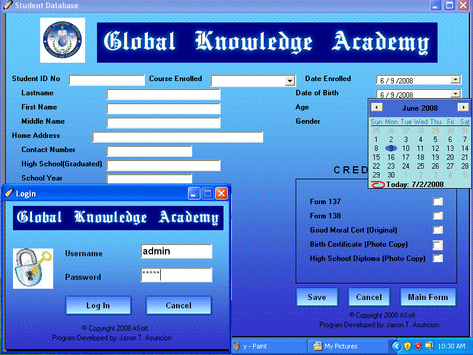



## Student Enrollment and Billing System

### Description

Student Enrollment and Billing System
 
### More Info
 
pls intall the lvbuttons.ocx at your system32 for you to be able to run this program

This is a enrollment and billing for a school. the username and password is admin and please install the lvbuttons.ocx(as part of this program)first to your system32 for you to be able to run this program properly or if you want, you can istall it directly to your computer by opening the setup.exe file. File leave a comment and vote for me. Any reaction from you guys is highly appreciated. I just want to know where are my skills are for a novice program like me. Thank you and enjoy!!!

             |
---                |---
**Submitted On**   |2008-07-01 21:07:46
**By**             |[Jason T\. Asuncion](https://github.com/Planet-Source-Code/PSCIndex/blob/master/ByAuthor/jason-t-asuncion.md)
**Level**          |Beginner
**User Rating**    |4.3 (13 globes from 3 users)
**Compatibility**  |VB 6\.0
**Category**       |[Complete Applications](https://github.com/Planet-Source-Code/PSCIndex/blob/master/ByCategory/complete-applications__1-27.md)
**World**          |[Visual Basic](https://github.com/Planet-Source-Code/PSCIndex/blob/master/ByWorld/visual-basic.md)
**Archive File**   |[Student\_En211911712008\.zip](https://github.com/Planet-Source-Code/jason-t-asuncion-student-enrollment-and-billing-system__1-70772/archive/master.zip)

